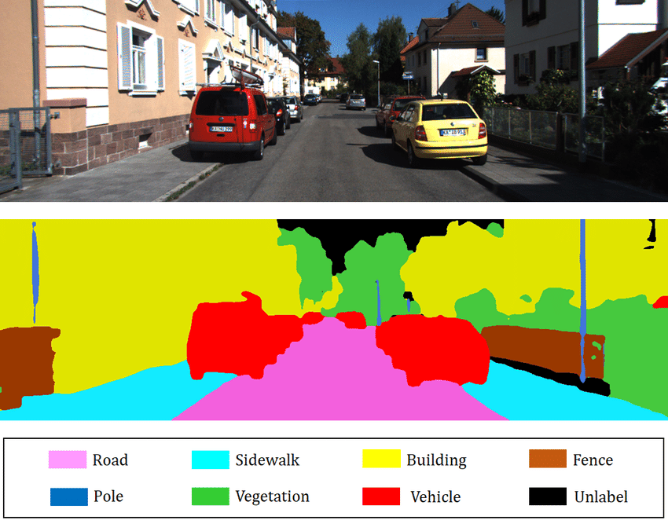

# Semantic Segmentation

## What is Semantic Segmentation?

Semantic Segmentation is segmenting an image into different part (or classes) based on semantics (or essentially words).
For example, if I had an image of a human walking a dog next to the street, maybe I want to segement that image into the human, the dog, and perhaps some cars.
To do this, I will be training an FCN model to detect 22 different classes of objects within an image.

## Why is this useful?

There are many reasons why we might want to semantically segment an image. Here are a few examples:

1. Autonomous driving vehicles may segment images from cameras and sensors to identify humans, other cars, signage, etc...
2. Satellites may segment images of space, identifying stars, nebulas, planets, etc... to locate their coordinates in space
3. Researchers may want to identify how much space is, on average, occupied by people walking around or by cars standing still in traffic

There are many use cases, this project will focus more on identifying 22 specific classes in particular for now.

## Extra Notes

Code for this is entirely consolidated to a Jupyter Notebook.
This was done mostly for purposes being able to use Google Colab GPUs, as I have no GPUs to easily train my model as of now. Thus, development on this project will be done primarily on Google Colab, though I plan on eventually moving away from that and fully onto my machine if I can.

## Future Developments

Currently, I'm trying to improve my fully connected layers in my semantic FCN model, as I believe that is bottlenecking my convolutional layers.

Data I used for training was provided by PASCAL, but I also want to see if I make personal training data that I can fit the model to train for objects I specify.

Also, I'm going to try tweaking my convolutional layers. Right now I upscale to 4096 x 4096 before pooling (stride of 2) down to 64 x 64, which should be enough for my fully connected layers to activate on features. But perhaps stopping before at around 128 or 256 will be better.

I do plan on continuing work on this project, expect occassional updates to the GitHub as most work is done on Colab.
